<div align="center">

# 🧪 End-to-End Testing Guide

**Complete Pipeline Testing from Data Ingestion to Verification**

[](https://github.com)
[](https://aws.amazon.com/cli/)
[](https://www.python.org/)

Test your **Realtime Medallion ML Feature Platform** end-to-end

</div>

---

## 📋 Prerequisites

<table>
<tr>
<td width="25%">

✅ **Infrastructure**  
Deployed via  
GitHub Actions

</td>
<td width="25%">

✅ **Terraform Outputs**  
Bucket names  
ARNs available

</td>
<td width="25%">

✅ **AWS CLI**  
Configured with  
credentials

</td>
<td width="25%">

✅ **Python Env**  
Dependencies  
installed

</td>
</tr>
</table>

---

## 🎯 Testing Workflow

```mermaid
graph LR
    A[📤 Upload Data] --> B[⚡ Trigger Pipeline]
    B --> C[👀 Monitor Execution]
    C --> D[✅ Verify Results]
    
    style A fill:#4CAF50
    style B fill:#2196F3
    style C fill:#FF9800
    style D fill:#9C27B0
```



---

## 1️⃣ Prepare Sample Data

### Step 1.1: Transform Sample Data

<details open>
<summary><b>🔄 Run Transformation Script</b></summary>

```powershell
# Navigate to project root
cd d:\Data_Project_Repo\AWS-Batch-Realtime-Medallion-ML-Feature-Platform-Pipeline

# Transform data to Bronze format
python scripts/transform_and_prepare_sample_data.py
```

**Expected Output**:
```
📖 Reading sample_data/bronze_sample_transactions.json...
✓ Loaded 20 records
🔄 Transforming records...
✓ Transformed 20 records
💾 Saving as JSON to ./data_output...
✓ Saved compressed JSON: ./data_output/bronze/streaming/card_authorization/ingest_dt=2025/10/23/16/30/data.json.gz
✅ Success!
```

</details>

### Step 1.2: Upload to S3

<details open>
<summary><b>☁️ Upload to Bronze Layer</b></summary>

```powershell
# Get bucket name from Terraform outputs
$DATALAKE_BUCKET = "your-datalake-bucket-name"

# Upload transformed data
aws s3 cp ./data_output/bronze/streaming/card_authorization/ingest_dt=2025/10/23/16/30/data.json.gz `
  s3://$DATALAKE_BUCKET/bronze/streaming/card_authorization/ingest_dt=2025/10/23/16/30/data.json.gz `
  --region ap-southeast-1

# Verify upload
aws s3 ls s3://$DATALAKE_BUCKET/bronze/streaming/card_authorization/ingest_dt=2025/10/23/16/30/
```

</details>

---

## 2️⃣ Trigger Pipeline

### Step 2.1: Set Parameters

<details open>
<summary><b>📝 Configure Variables</b></summary>

```powershell
# From Terraform outputs
$SFN_ARN = "arn:aws:states:ap-southeast-1:ACCOUNT:stateMachine:stream-pipeline"
$APP_ID = "your-emr-application-id"
$DATA_BUCKET = "your-datalake-bucket-name"
$CODE_BUCKET = "your-code-bucket-name"
$EMR_JOB_ROLE = "arn:aws:iam::ACCOUNT:role/your-emr-job-role"

# Generate timestamp
$NOW = (Get-Date).ToUniversalTime().ToString("yyyy-MM-ddTHH:mm:ssZ")
```

</details>

### Step 2.2: Execute Step Functions

<details open>
<summary><b>🚀 Start Stream Pipeline</b></summary>

```powershell
aws stepfunctions start-execution `
  --state-machine-arn $SFN_ARN `
  --input "{
    \"mode\":\"stream\",
    \"now\":\"$NOW\",
    \"bucket\":\"$DATA_BUCKET\",
    \"codeBucket\":\"$CODE_BUCKET\",
    \"bronzePrefix\":\"bronze/streaming\",
    \"silverPrefix\":\"silver\",
    \"goldPrefix\":\"gold\",
    \"featureGroup\":\"rt_card_features_v1\",
    \"emr\":{
      \"appId\":\"$APP_ID\",
      \"jobRole\":\"$EMR_JOB_ROLE\"
    }
  }" `
  --region ap-southeast-1
```

</details>

### Step 2.3: Save Execution ARN

<details>
<summary><b>📌 Record ARN for Monitoring</b></summary>

```powershell
# Command output example:
# {
#     "executionArn": "arn:aws:states:ap-southeast-1:ACCOUNT:execution:stream-pipeline:xxxxx",
#     "startDate": "2025-10-24T10:00:00.000Z"
# }

$EXECUTION_ARN = "arn:aws:states:ap-southeast-1:ACCOUNT:execution:stream-pipeline:xxxxx"
```

</details>

---

## 3️⃣ Monitor Execution

### Step 3.1: Check Step Functions Status

<details open>
<summary><b>🔄 Monitor Workflow</b></summary>

```powershell
# Check execution status
aws stepfunctions describe-execution `
  --execution-arn $EXECUTION_ARN `
  --region ap-southeast-1

# Status progression: RUNNING → SUCCEEDED
```

**Status Indicators**:
- 🟡 `RUNNING` - Execution in progress
- 🟢 `SUCCEEDED` - Completed successfully
- 🔴 `FAILED` - Execution failed (check logs)

</details>

### Step 3.2: Monitor EMR Jobs

<details open>
<summary><b>⚡ Track Spark Jobs</b></summary>

```powershell
# Get EMR job details from execution history
aws stepfunctions get-execution-history `
  --execution-arn $EXECUTION_ARN `
  --region ap-southeast-1

# Find job ID, then check status
$JOB_RUN_ID = "your-job-run-id"
aws emr-serverless get-job-run `
  --application-id $APP_ID `
  --job-run-id $JOB_RUN_ID `
  --region ap-southeast-1
```

</details>

### Step 3.3: View CloudWatch Logs

<details open>
<summary><b>📊 Real-time Logs</b></summary>

**EMR Serverless Logs**:
```powershell
aws logs tail /aws/emr-serverless/applications/$APP_ID/jobs/$JOB_RUN_ID `
  --region ap-southeast-1 `
  --follow
```

**Step Functions Logs**:
```powershell
aws logs tail /aws/states/stream-pipeline/$EXECUTION_ARN `
  --region ap-southeast-1 `
  --follow
```

</details>

### Step 3.4: Access CloudWatch Dashboard

<details>
<summary><b>📈 Visual Monitoring</b></summary>

```powershell
# Open dashboard in browser
$DASHBOARD_URL = "https://ap-southeast-1.console.aws.amazon.com/cloudwatch/home?region=ap-southeast-1#dashboards:name=your-project-dev-dashboard"
Start-Process $DASHBOARD_URL
```

**Dashboard Metrics**:
- Pipeline execution count
- Success/failure rates
- Processing latency
- Resource utilization

</details>

---

## 4️⃣ Verify Results

### Step 4.1: Check S3 Outputs

<details open>
<summary><b>🪣 Verify Data Layers</b></summary>

**Silver Layer** (Cleaned Data):
```powershell
aws s3 ls s3://$DATA_BUCKET/silver/card_transactions/ --recursive --region ap-southeast-1
```

**Gold Layer** (Features):
```powershell
aws s3 ls s3://$DATA_BUCKET/gold/card_features/ --recursive --region ap-southeast-1
```

**Sample Gold Data**:
```powershell
aws s3 cp s3://$DATA_BUCKET/gold/card_features/dt=2025-10-24/part-00000-xxx.parquet - `
  --region ap-southeast-1 | head -20
```

</details>

### Step 4.2: Check Feature Store

<details open>
<summary><b>🎯 Verify Online Store (DynamoDB)</b></summary>

```powershell
aws sagemaker get-record `
  --feature-group-name rt_card_features_v1 `
  --record-identifier-value-as-string "card_00001" `
  --region ap-southeast-1
```

**Expected Output**: Feature values with timestamps

</details>

<details open>
<summary><b>💾 Verify Offline Store (S3)</b></summary>

```powershell
aws s3 ls s3://sagemaker-ap-southeast-1-ACCOUNT-offline-store/rt_card_features_v1/ `
  --recursive `
  --region ap-southeast-1
```

</details>

### Step 4.3: Query Glue Catalog

<details open>
<summary><b>🗄️ Check Table Metadata</b></summary>

```powershell
# Check if table exists
aws glue get-table `
  --database-name sagemaker_featurestore `
  --name rt_card_features_v1 `
  --region ap-southeast-1

# Query via Athena
aws athena start-query-execution `
  --query-string "SELECT * FROM rt_card_features_v1 LIMIT 10" `
  --query-execution-context Database=sagemaker_featurestore `
  --result-configuration OutputLocation=s3://$DATA_BUCKET/athena-results/ `
  --region ap-southeast-1
```

</details>

---

## 5️⃣ Test Daily Batch Pipeline

### Step 5.1: Trigger Daily Mode

<details open>
<summary><b>📅 Execute Batch Processing</b></summary>

```powershell
aws stepfunctions start-execution `
  --state-machine-arn $SFN_ARN `
  --input "{
    \"mode\":\"daily\",
    \"bucket\":\"$DATA_BUCKET\",
    \"codeBucket\":\"$CODE_BUCKET\",
    \"goldPrefix\":\"gold\",
    \"trainingPrefix\":\"gold/training\",
    \"inferencePrefix\":\"gold/inference\",
    \"emr\":{
      \"appId\":\"$APP_ID\",
      \"jobRole\":\"$EMR_JOB_ROLE\"
    }
  }" `
  --region ap-southeast-1
```

</details>

### Step 5.2: Verify Training/Inference Datasets

<details open>
<summary><b>📚 Check Dataset Outputs</b></summary>

**Training Datasets**:
```powershell
aws s3 ls s3://$DATA_BUCKET/gold/training/ --recursive --region ap-southeast-1
```

**Inference Datasets**:
```powershell
aws s3 ls s3://$DATA_BUCKET/gold/inference/ --recursive --region ap-southeast-1
```

**Sample Training Data**:
```powershell
aws s3 cp s3://$DATA_BUCKET/gold/training/dt=2025-10-24/train/part-00000-xxx.parquet - `
  --region ap-southeast-1 | head -10
```

</details>

---

## ✅ Success Checklist

<div align="center">

| Component | Expected Result | Verification Method |
|:---------:|:---------------:|:-------------------:|
| 🥉 **Bronze** | `data.json.gz` files | `aws s3 ls s3://...` |
| 🥈 **Silver** | `*.parquet` files | `aws s3 ls s3://...` |
| 🥇 **Gold** | Feature parquet files | `aws s3 ls s3://...` |
| 🎯 **Online Store** | Records retrievable | `aws sagemaker get-record` |
| 💾 **Offline Store** | S3 files exist | `aws s3 ls sagemaker-*` |
| 🗄️ **Glue Catalog** | Table created | `aws glue get-table` |
| 📚 **Training** | Train/val splits | `aws s3 ls .../training/` |
| 🔮 **Inference** | Latest features | `aws s3 ls .../inference/` |

</div>

---

## 📊 Key Metrics to Monitor

<details>
<summary><b>📈 CloudWatch Metrics</b></summary>

```powershell
aws cloudwatch get-metric-statistics `
  --namespace "P1Unified" `
  --metric-name "StreamPipelineSuccess" `
  --start-time 2025-10-24T00:00:00Z `
  --end-time 2025-10-24T23:59:59Z `
  --period 3600 `
  --statistics Sum `
  --region ap-southeast-1
```

**Key Metrics**:
- Pipeline execution count
- Success rate (target: >95%)
- Processing latency (target: <10min)
- EMR job duration

</details>

---

## 🚨 Troubleshooting

<details>
<summary><b>❌ EMR Job Failure</b></summary>

**Check Logs**:
```powershell
aws logs tail /aws/emr-serverless/applications/$APP_ID/jobs/$JOB_RUN_ID `
  --region ap-southeast-1
```

**Common Issues**:
- ❌ S3 permissions missing
- ❌ Spark code syntax errors
- ❌ Feature Group not created

</details>

<details>
<summary><b>❌ No Data in Feature Store</b></summary>

**Check Feature Group Status**:
```powershell
aws sagemaker describe-feature-group `
  --feature-group-name rt_card_features_v1 `
  --region ap-southeast-1
```

**Status**: Must be `Created`

</details>

<details>
<summary><b>❌ Step Functions Stuck</b></summary>

**Check Execution History**:
```powershell
aws stepfunctions get-execution-history `
  --execution-arn $EXECUTION_ARN `
  --region ap-southeast-1
```

**Common Causes**:
- EMR job taking longer than expected
- Wait state timeout too short
- Resource capacity issues

</details>

---

## 🎯 Complete Testing Script

<details>
<summary><b>🤖 Automated Test Script</b></summary>

Save as `test_pipeline.ps1`:

```powershell
param(
    [string]$DataBucket,
    [string]$CodeBucket,
    [string]$EmrAppId,
    [string]$EmrJobRole,
    [string]$StepFunctionArn
)

Write-Host "🚀 Starting Pipeline Test..." -ForegroundColor Green

# 1. Transform and upload data
Write-Host "`n📤 Uploading sample data..." -ForegroundColor Cyan
python scripts/transform_and_prepare_sample_data.py

aws s3 cp ./data_output/bronze/streaming/card_authorization/ingest_dt=2025/10/23/16/30/data.json.gz `
  s3://$DataBucket/bronze/streaming/card_authorization/ingest_dt=2025/10/23/16/30/data.json.gz `
  --region ap-southeast-1

# 2. Trigger stream pipeline
Write-Host "`n⚡ Triggering stream pipeline..." -ForegroundColor Cyan
$now = (Get-Date).ToUniversalTime().ToString("yyyy-MM-ddTHH:mm:ssZ")
$result = aws stepfunctions start-execution `
  --state-machine-arn $StepFunctionArn `
  --input "{\"mode\":\"stream\",\"now\":\"$now\",\"bucket\":\"$DataBucket\",\"codeBucket\":\"$CodeBucket\",\"bronzePrefix\":\"bronze/streaming\",\"silverPrefix\":\"silver\",\"goldPrefix\":\"gold\",\"featureGroup\":\"rt_card_features_v1\",\"emr\":{\"appId\":\"$EmrAppId\",\"jobRole\":\"$EmrJobRole\"}}" `
  --region ap-southeast-1 | ConvertFrom-Json

$executionArn = $result.executionArn
Write-Host "Execution ARN: $executionArn" -ForegroundColor Yellow

# 3. Monitor execution
Write-Host "`n👀 Monitoring execution..." -ForegroundColor Cyan
do {
    $status = aws stepfunctions describe-execution `
      --execution-arn $executionArn `
      --region ap-southeast-1 | ConvertFrom-Json
    
    Write-Host "Status: $($status.status)" -ForegroundColor $(if ($status.status -eq "RUNNING") {"Yellow"} else {"Green"})
    Start-Sleep -Seconds 30
} while ($status.status -eq "RUNNING")

# 4. Check results
Write-Host "`n✅ Checking results..." -ForegroundColor Cyan
aws s3 ls s3://$DataBucket/gold/card_features/ --recursive --region ap-southeast-1

aws sagemaker get-record `
  --feature-group-name rt_card_features_v1 `
  --record-identifier-value-as-string "card_00001" `
  --region ap-southeast-1

Write-Host "`n🎉 Pipeline test complete!" -ForegroundColor Green
```

**Usage**:
```powershell
.\test_pipeline.ps1 `
  -DataBucket "your-bucket" `
  -CodeBucket "your-code-bucket" `
  -EmrAppId "your-app-id" `
  -EmrJobRole "arn:aws:iam::123:role/your-role" `
  -StepFunctionArn "arn:aws:states:region:123:stateMachine:stream-pipeline"
```

</details>

---

## 💰 Cost Monitoring

<details>
<summary><b>💵 Track Testing Costs</b></summary>

```powershell
aws cloudwatch get-metric-statistics `
  --namespace "AWS/Billing" `
  --metric-name "EstimatedCharges" `
  --dimensions Name=ServiceName,Value=AmazonSageMaker Name=ServiceName,Value=EMRServerless `
  --start-time 2025-10-24T00:00:00Z `
  --end-time 2025-10-24T23:59:59Z `
  --period 3600 `
  --statistics Maximum `
  --region us-east-1
```

</details>

---

## 🧹 Cleanup

<details>
<summary><b>🗑️ Remove Test Data</b></summary>

```powershell
# Clean up S3 test data
aws s3 rm s3://$DATA_BUCKET/bronze/streaming/card_authorization/ --recursive --region ap-southeast-1
aws s3 rm s3://$DATA_BUCKET/silver/ --recursive --region ap-southeast-1
aws s3 rm s3://$DATA_BUCKET/gold/ --recursive --region ap-southeast-1

# Remove local test files
Remove-Item -Path ./data_output -Recurse -Force
```

</details>

---

<div align="center">

**✨ Testing Complete!**

Monitor your pipeline with [CloudWatch Dashboard](https://console.aws.amazon.com/cloudwatch/)

---

**Questions?** Check [Troubleshooting](README.md#troubleshooting) or open an issue

</div>

# Find the EMR job ID in the history, then check:
aws emr-serverless get-job-run --application-id $APP_ID --job-run-id $JOB_RUN_ID --region ap-southeast-1
```

### Step 3.3: Monitor CloudWatch Logs

```powershell
# EMR Serverless logs
aws logs tail /aws/emr-serverless/applications/$APP_ID/jobs/$JOB_RUN_ID --region ap-southeast-1 --follow

# Step Functions logs
aws logs tail /aws/states/stream-pipeline/$EXECUTION_ARN --region ap-southeast-1 --follow
```

### Step 3.4: Monitor CloudWatch Dashboard

```powershell
# Open dashboard in browser
$DASHBOARD_URL = "https://ap-southeast-1.console.aws.amazon.com/cloudwatch/home?region=ap-southeast-1#dashboards:name=your-project-dev-dashboard"
Start-Process $DASHBOARD_URL
```

---

## 4️⃣ Verify Pipeline Results

### Step 4.1: Check S3 Outputs

```powershell
# Check Silver layer (cleaned data)
aws s3 ls s3://$DATA_BUCKET/silver/card_transactions/ --recursive --region ap-southeast-1

# Check Gold layer (features)
aws s3 ls s3://$DATA_BUCKET/gold/card_features/ --recursive --region ap-southeast-1

# Sample Gold data
aws s3 cp s3://$DATA_BUCKET/gold/card_features/dt=2025-10-24/part-00000-xxx.parquet - --region ap-southeast-1 | head -20
```

### Step 4.2: Check Feature Store

#### Online Store (DynamoDB)
```powershell
# Check if records exist in Online Store
aws sagemaker get-record `
  --feature-group-name rt_card_features_v1 `
  --record-identifier-value-as-string "card_00001" `
  --region ap-southeast-1
```

#### Offline Store (S3)
```powershell
# Check Offline Store data
aws s3 ls s3://sagemaker-ap-southeast-1-ACCOUNT-offline-store/rt_card_features_v1/ --recursive --region ap-southeast-1
```

### Step 4.3: Check Glue Catalog

```powershell
# Check if table was created
aws glue get-table --database-name sagemaker_featurestore --name rt_card_features_v1 --region ap-southeast-1

# Query via Athena
aws athena start-query-execution `
  --query-string "SELECT * FROM rt_card_features_v1 LIMIT 10" `
  --query-execution-context Database=sagemaker_featurestore `
  --result-configuration OutputLocation=s3://$DATA_BUCKET/athena-results/ `
  --region ap-southeast-1
```

---

## 5️⃣ Test Daily Batch Pipeline

### Step 5.1: Trigger Daily Mode

```powershell
aws stepfunctions start-execution `
  --state-machine-arn $SFN_ARN `
  --input "{
    \"mode\":\"daily\",
    \"bucket\":\"$DATA_BUCKET\",
    \"codeBucket\":\"$CODE_BUCKET\",
    \"goldPrefix\":\"gold\",
    \"trainingPrefix\":\"gold/training\",
    \"inferencePrefix\":\"gold/inference\",
    \"emr\":{
      \"appId\":\"$APP_ID\",
      \"jobRole\":\"$EMR_JOB_ROLE\"
    }
  }" `
  --region ap-southeast-1
```

### Step 5.2: Check Training/Inference Datasets

```powershell
# Check training datasets
aws s3 ls s3://$DATA_BUCKET/gold/training/ --recursive --region ap-southeast-1

# Check inference datasets
aws s3 ls s3://$DATA_BUCKET/gold/inference/ --recursive --region ap-southeast-1

# Sample training data
aws s3 cp s3://$DATA_BUCKET/gold/training/dt=2025-10-24/train/part-00000-xxx.parquet - --region ap-southeast-1 | head -10
```

---

## 📊 Key Observations

### ✅ Success Indicators

| Component | Expected | Check Method |
|-----------|----------|--------------|
| **S3 Bronze** | `data.json.gz` | `aws s3 ls s3://bucket/bronze/...` |
| **S3 Silver** | `*.parquet` files | `aws s3 ls s3://bucket/silver/...` |
| **S3 Gold** | `*.parquet` with features | `aws s3 ls s3://bucket/gold/...` |
| **Online Store** | Records retrievable | `aws sagemaker get-record` |
| **Offline Store** | S3 files | `aws s3 ls sagemaker-*-offline-store/` |
| **Glue Catalog** | Table exists | `aws glue get-table` |
| **Training Data** | Train/val split | `aws s3 ls s3://bucket/gold/training/` |
| **Inference Data** | Latest features | `aws s3 ls s3://bucket/gold/inference/` |

### 🔍 Critical Metrics

```powershell
# CloudWatch metrics to monitor
aws cloudwatch get-metric-statistics `
  --namespace "P1Unified" `
  --metric-name "StreamPipelineSuccess" `
  --start-time 2025-10-24T00:00:00Z `
  --end-time 2025-10-24T23:59:59Z `
  --period 3600 `
  --statistics Sum `
  --region ap-southeast-1
```

### 🚨 Common Issues

#### EMR Job Failure
```powershell
# Check EMR logs
aws logs tail /aws/emr-serverless/applications/$APP_ID/jobs/$JOB_RUN_ID --region ap-southeast-1

# Common issues:
# - S3 permissions
# - Spark code syntax errors
# - Feature Group not created
```

#### No Data in Feature Store
```powershell
# Check Feature Group status
aws sagemaker describe-feature-group --feature-group-name rt_card_features_v1 --region ap-southeast-1

# Should be "FeatureGroupStatus": "Created"
```

#### Step Functions Stuck
```powershell
# Check execution history
aws stepfunctions get-execution-history --execution-arn $EXECUTION_ARN --region ap-southeast-1
```

---

## 🎯 Complete Testing Script

```powershell
# One-liner test script (save as test_pipeline.ps1)
param(
    [string]$DataBucket,
    [string]$CodeBucket,
    [string]$EmrAppId,
    [string]$EmrJobRole,
    [string]$StepFunctionArn
)

Write-Host "🚀 Starting Pipeline Test..."

# 1. Transform and upload data
Write-Host "📤 Uploading sample data..."
python scripts/transform_and_prepare_sample_data.py
aws s3 cp ./data_output/bronze/streaming/card_authorization/ingest_dt=2025/10/23/16/30/data.json.gz s3://$DataBucket/bronze/streaming/card_authorization/ingest_dt=2025/10/23/16/30/data.json.gz --region ap-southeast-1

# 2. Trigger stream pipeline
Write-Host "⚡ Triggering stream pipeline..."
$now = (Get-Date).ToUniversalTime().ToString("yyyy-MM-ddTHH:mm:ssZ")
$result = aws stepfunctions start-execution --state-machine-arn $StepFunctionArn --input "{\"mode\":\"stream\",\"now\":\"$now\",\"bucket\":\"$DataBucket\",\"codeBucket\":\"$CodeBucket\",\"bronzePrefix\":\"bronze/streaming\",\"silverPrefix\":\"silver\",\"goldPrefix\":\"gold\",\"featureGroup\":\"rt_card_features_v1\",\"emr\":{\"appId\":\"$EmrAppId\",\"jobRole\":\"$EmrJobRole\"}}" --region ap-southeast-1 | ConvertFrom-Json
$executionArn = $result.executionArn

# 3. Monitor execution
Write-Host "👀 Monitoring execution: $executionArn"
do {
    $status = aws stepfunctions describe-execution --execution-arn $executionArn --region ap-southeast-1 | ConvertFrom-Json
    Write-Host "Status: $($status.status)"
    Start-Sleep -Seconds 30
} while ($status.status -eq "RUNNING")

# 4. Check results
Write-Host "✅ Checking results..."
aws s3 ls s3://$DataBucket/gold/card_features/ --recursive --region ap-southeast-1
aws sagemaker get-record --feature-group-name rt_card_features_v1 --record-identifier-value-as-string "card_00001" --region ap-southeast-1

Write-Host "🎉 Pipeline test complete!"
```

---

## 💰 Cost Monitoring

```powershell
# Check costs (CloudWatch)
aws cloudwatch get-metric-statistics `
  --namespace "AWS/Billing" `
  --metric-name "EstimatedCharges" `
  --dimensions Name=ServiceName,Value=AmazonSageMaker Name=ServiceName,Value=EMRServerless `
  --start-time 2025-10-24T00:00:00Z `
  --end-time 2025-10-24T23:59:59Z `
  --period 3600 `
  --statistics Maximum `
  --region us-east-1
```

---

## 🧹 Cleanup

```powershell
# Clean up test data
aws s3 rm s3://$DATA_BUCKET/bronze/streaming/card_authorization/ --recursive --region ap-southeast-1
aws s3 rm s3://$DATA_BUCKET/silver/ --recursive --region ap-southeast-1
aws s3 rm s3://$DATA_BUCKET/gold/ --recursive --region ap-southeast-1

# Remove local test files
Remove-Item -Path ./data_output -Recurse -Force
```

---

**🎯 Summary**: Follow steps 1-4 for complete end-to-end testing. Monitor CloudWatch and check S3 outputs at each stage!