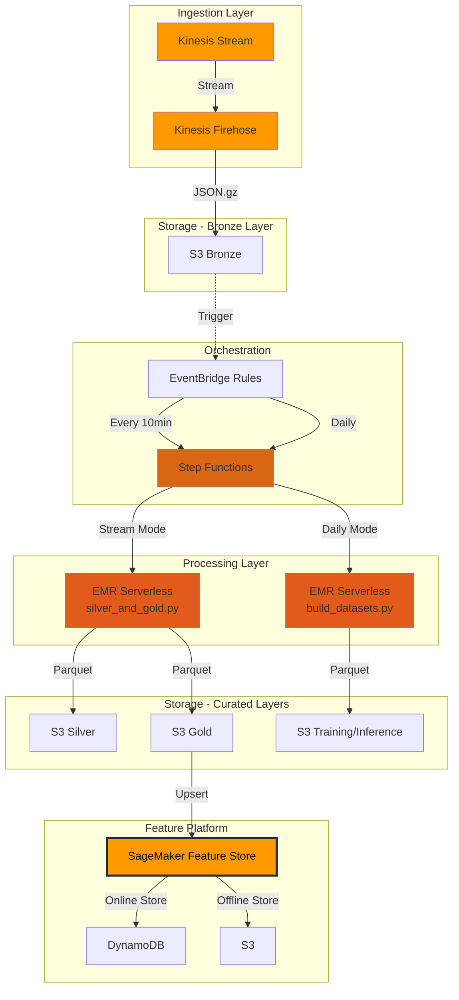

<div align="center">

# ⚡ AWS Realtime Medallion ML Feature Platform

[](https://aws.amazon.com/)
[](https://www.terraform.io/)
[](https://spark.apache.org/)
[](https://www.python.org/)

**Enterprise-grade serverless data pipeline for real-time ML feature engineering**

[📖 Documentation](#documentation) • [🚀 Quick Start](#deployment-guide) • [🧪 Testing](#-end-to-end-testing-guide) • [💰 Cost](#cost-estimation)

</div>

---

## 🎯 Overview

A production-ready **Serverless Medallion Architecture** built on AWS for processing real-time card transaction data, performing advanced feature engineering, and generating ML-ready datasets.

### ✨ Key Features

<table>
<tr>
<td width="50%">

🌍 **Region**  
`ap-southeast-1` (Singapore)

📊 **Data Architecture**  
Bronze → Silver → Gold (Medallion)

⚡ **Real-time Processing**  
Kinesis + Firehose + EMR Serverless

</td>
<td width="50%">

🎯 **Feature Platform**  
SageMaker Feature Store (Online + Offline)

📦 **Batch Processing**  
Daily training & inference datasets

🔄 **Orchestration**  
Step Functions state machine

</td>
</tr>
<tr>
<td colspan="2">

🏗️ **Infrastructure as Code**: Terraform modules  
🔁 **CI/CD**: GitHub Actions with OIDC

</td>
</tr>
</table>

---

## 🏗️ Architecture Diagram

<div align="center">



</div>

---

## 📂 Project Structure

```
📦 AWS-Batch-Realtime-Medallion-ML-Feature-Platform-Pipeline
├── 🏗️  infra/terraform/                # Infrastructure as Code
│   ├── 📄 main.tf                      # Root module
│   ├── 🔧 variables.tf                 # Variable definitions
│   ├── 📊 outputs.tf                   # Output values
│   └── 📦 modules/                     # Reusable Terraform modules
│       ├── 🪣  s3_datalake/            # S3 bucket configuration
│       ├── 🌊 kinesis_firehose/        # Kinesis streaming setup
│       ├── ⚡ emr_serverless/          # EMR Serverless config
│       ├── 🗄️  glue/                   # Glue catalog
│       ├── 🎯 sagemaker_featurestore/  # Feature Store setup
│       ├── 🔄 step_functions/          # Workflow orchestration
│       ├── ⏰ eventbridge/             # Event scheduling
│       └── 📈 cloudwatch/              # Monitoring & alarms
├── 🎭 state_machines/                  # Step Functions definitions
│   └── stream_pipeline.asl.json
├── ⚙️  spark_jobs/                     # PySpark processing jobs
│   ├── silver_and_gold.py              # Bronze → Silver → Gold
│   └── build_datasets.py               # Training/inference datasets
├── 🎯 feature_store/                   # Feature Store utilities
│   ├── register_feature_groups.py
│   └── ingest_features.py
├── 🔧 scripts/                         # Utility scripts
│   └── transform_and_prepare_sample_data.py
├── 📊 sample_data/                     # Sample transaction data
│   └── bronze_sample_transactions.json
├── 🔁 .github/workflows/               # CI/CD pipelines
│   ├── deploy.yml                      # Deployment workflow
│   └── destroy.yml                     # Teardown workflow
├── 📖 DEPLOYMENT_GUIDE.md              # Detailed deployment guide
├── 🧪 E2E_TESTING_GUIDE.md             # End-to-end testing guide
├── 📋 requirements.txt                 # Python dependencies
└── 📝 README.md                        # This file
```

---

## 📊 Data Model

### 🥉 Bronze Layer
**Raw streaming data ingestion**

```yaml
Path: s3://bucket/bronze/streaming/card_authorization/ingest_dt=YYYY/MM/DD/HH/mm/*.json.gz
Format: Compressed NDJSON
Schema:
  - event_id: string       # Unique transaction identifier
  - card_id: string        # Card identifier
  - ts: timestamp          # Transaction timestamp (Unix)
  - merchant_id: string    # Merchant identifier
  - amount: float          # Transaction amount
  - currency: string       # Currency code (USD, EUR, etc.)
  - country: string        # Country code
  - pos_mode: string       # POS mode (chip, contactless, etc.)
```

### 🥈 Silver Layer
**Cleaned & validated data**

```yaml
Path: s3://bucket/silver/card_transactions/dt=YYYY-MM-DD/*.parquet
Format: Parquet (Snappy)
Processing: Deduplication, validation, type casting
Partitioning: Daily (dt=YYYY-MM-DD)
```

### 🥇 Gold Layer
**Feature-enriched data**

```yaml
Path: s3://bucket/gold/card_features/dt=YYYY-MM-DD/*.parquet
Format: Parquet (Snappy)
Features:
  📈 txn_count_1h: int          # Transactions in last 1 hour
  💰 txn_amount_1h: float       # Total amount in last 1 hour
  🏪 merchant_count_24h: int    # Unique merchants in 24 hours
  📊 avg_amount_7d: float       # 7-day average transaction amount
```

### 🎓 Training/Inference Datasets

| Dataset | Path | Purpose |
|---------|------|---------|
| **Training** | `s3://bucket/gold/training/dt=YYYY-MM-DD/train/*.parquet` | Model training |
| **Validation** | `s3://bucket/gold/training/dt=YYYY-MM-DD/validation/*.parquet` | Model validation |
| **Inference** | `s3://bucket/gold/inference/dt=YYYY-MM-DD/*.parquet` | Real-time predictions |

---

## 🚀 Deployment Guide

### Prerequisites

<table>
<tr>
<td>

**☁️ AWS Account**  
Appropriate IAM permissions for resource creation

</td>
<td>

**🔧 AWS CLI**  
Configured with credentials (`aws configure`)

</td>
<td>

**🐙 GitHub Repository**  
OIDC configured for GitHub Actions

</td>
</tr>
</table>

> 📖 **Detailed deployment steps**: See [`DEPLOYMENT_GUIDE.md`](DEPLOYMENT_GUIDE.md) for comprehensive instructions including Terraform Backend setup, GitHub OIDC configuration, and automated CI/CD deployment.

---

## 🧪 End-to-End Testing Guide

> 🔬 **Complete testing procedures**: Refer to [`E2E_TESTING_GUIDE.md`](E2E_TESTING_GUIDE.md) for:
> - 📤 Sample data preparation
> - ⚡ Pipeline triggering (stream & batch modes)
> - 👀 Monitoring & observability
> - ✅ Result verification

---

## 📈 Monitoring

### CloudWatch Dashboard

<div align="center">

**Access Path**: AWS Console → CloudWatch → Dashboards → `{project}-{env}-dashboard`

| Metric | Description |
|--------|-------------|
| 🔄 **Step Functions Status** | Execution success/failure rates |
| ⚡ **EMR Job Success Rate** | Spark job completion metrics |
| 🌊 **Firehose Delivery Rate** | Stream delivery performance |
| 📊 **Custom Pipeline Metrics** | End-to-end processing latency |

</div>

### ⚠️ Alarms

| Alarm | Trigger Condition | Action |
|-------|-------------------|--------|
| 🚨 **SFN Execution Failed** | Step Functions execution failure | SNS notification |
| 🚨 **Firehose Delivery Failed** | Success rate < 95% | SNS notification |

---

## 💰 Cost Estimation

<div align="center">

**Development Environment** • ~1M events/day

| Service | Usage | Monthly Cost |
|:--------|:------|:------------:|
| 🌊 Kinesis Data Stream | 1 shard, 24/7 | **$11** |
| 🔥 Kinesis Firehose | 1M records | **$5** |
| 🪣 S3 Storage | 100 GB | **$2.3** |
| ⚡ EMR Serverless | 144 runs/day, 5min each | **$20** |
| 🔄 Step Functions | 144 executions/day | **$0.03** |
| 🎯 SageMaker Feature Store | 1M writes, 100K reads | **$10** |
| | **Total Estimate** | **~$50/month** |

</div>

### 💡 Cost Optimization Tips

```yaml
✅ S3 Lifecycle Policies: 30-day retention → Save on storage
✅ EMR Auto-stop: 15min idle timeout → Pay only for active jobs  
✅ Kinesis On-Demand: Variable workloads → No over-provisioning
✅ EventBridge Disable: Manual triggering during dev → Near-zero fixed costs
```

---

## 🔧 Troubleshooting

<details>
<summary><b>⚡ EMR Job Failure</b></summary>

1. **Check CloudWatch Logs**
   ```bash
   aws logs tail /aws/emr-serverless/applications/{app-id}/jobs/{job-id} --follow
   ```

2. **Verify S3 Permissions**
   - Ensure EMR job role has `s3:GetObject`, `s3:PutObject` permissions
   - Check bucket policies and ACLs

3. **Validate Spark Code**
   - Test locally with `spark-submit --master local[*]`
   - Check for Python syntax errors or missing dependencies

</details>

<details>
<summary><b>🎯 Feature Store Upsert Failure</b></summary>

1. **Check Feature Group Status**
   ```bash
   aws sagemaker describe-feature-group --feature-group-name rt_card_features_v1
   ```
   Status should be `Created`

2. **Verify IAM Permissions**
   - Role needs: `sagemaker-featurestore-runtime:BatchPutRecord`
   - Check trust relationship for SageMaker service

3. **Validate Schema Consistency**
   - Ensure feature definitions match data schema
   - Check data types (String, Integral, Fractional)

</details>

<details>
<summary><b>🔄 Step Functions Timeout</b></summary>

1. **Increase EMR Capacity**
   ```hcl
   # In terraform.tfvars
   emr_driver_cores = 2
   emr_executor_cores = 2
   ```

2. **Adjust Wait States**
   ```json
   {
     "Type": "Wait",
     "Seconds": 300  // Increase if needed
   }
   ```

3. **Check Job Bottlenecks**
   - Review Spark UI for stage-level metrics
   - Identify data skew or shuffle operations

</details>

---

##  Documentation

| Document | Description |
|----------|-------------|
| 📖 [DEPLOYMENT_GUIDE.md](DEPLOYMENT_GUIDE.md) | Step-by-step deployment instructions |
| 🧪 [E2E_TESTING_GUIDE.md](E2E_TESTING_GUIDE.md) | End-to-end testing procedures |
| 🔗 [AWS EMR Serverless](https://docs.aws.amazon.com/emr/latest/EMR-Serverless-UserGuide/) | Official EMR documentation |
| 🔗 [SageMaker Feature Store](https://docs.aws.amazon.com/sagemaker/latest/dg/feature-store.html) | Feature Store guide |
| 🔗 [AWS Step Functions](https://docs.aws.amazon.com/step-functions/) | Workflow orchestration |

---

<div align="center">

## 📄 License

**MIT License** - Patrick Cheung

---

**Author**: Patrick Cheung | **Last Updated**: October 24, 2025

⭐ **Star this repo** if you find it useful!

</div>
